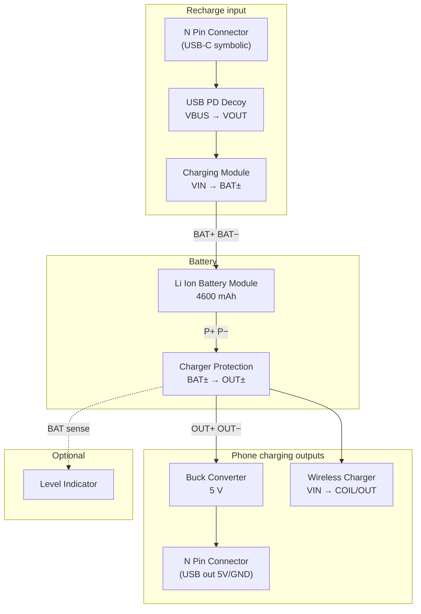

# 4600 mAh Power Bank — CircuitWiz Build Guide

How to combine **registered** CircuitWiz components into a portable pack that stores **4600 mAh**, recharges over **USB**, and delivers **USB wired** + **Qi wireless** phone charging.

> Based on anchors in `componentPlan.md` / `logicIndex.ts` as of the current catalog.  
> This is a **schematic + DC sim** recipe, not a full product BOM.

---

## Target spec

| Parameter | Value |
|-----------|--------|
| Pack energy | **4600 mAh** (nameplate) |
| Wired phone output | **5 V USB** (typical phone charge) |
| Wireless output | **Qi TX** (phone rests on coil; no cable) |
| Pack input | **USB-C PD** (recharge the bank) |
| Optional | State-of-charge LEDs |

---

## Registered components used

| Role | Palette name (exact) | Anchor | Placement config |
|------|----------------------|--------|------------------|
| Battery pack | **Li Ion Battery Module** | `LiIonPack` | **S/P** + per-cell **mAh** |
| BMS / protection | **Charger Protection** | `ChargerProtection` | **S** = series cells |
| USB-C PD input | **USB PD Decoy** | `UsbPdDecoy` | **9–20 V** profile, **W** class |
| Li-ion charger IC block | **Charging Module** | `ChargerDriver` | **W** + aux **V** (if used) |
| 5 V USB output | **Buck Converter** | `PowerDriver` | **5 V**, **10–15 W** |
| Qi transmitter | **Wireless Charger** | `WirelessCharger` | **5–10 W** TX |
| USB port (symbolic) | **N Pin Connector** | `NPinConnector` | 4–6 pins, plug/socket |
| Optional SoC LEDs | **Level Indicator** | `LevelIndicator` | **S** matches pack |
| Optional input cap | **Electrolytic Capacitor** | `Capacitor` | alias |
| Optional test load | **Resistor** | `Resistor` | alias |

**Not used (wrong function):** `Bluetooth Module`, `Antenna` — those are UART/RF data, not Qi power transfer.

**Not registered:** dedicated USB-A/C receptacle, phone receiver coil, PMIC (IP5328 / SW6106 style all-in-one), load switch, fuel gauge IC.

---

## Pack sizing → 4600 mAh

Configure **Li Ion Battery Module** at placement:

### Option A — 1S pouch (simplest power-bank topology)

| Setting | Value |
|---------|--------|
| Layout | **1S1P** (preset) or Custom **1S / 1P** |
| Per-cell capacity | **Custom → 4600 mAh** |
| Nominal sim voltage | **3.7 V** (1 × 3.7) |
| Stored `capacityAh` | **4.6 Ah** (auto from config) |

Best match for a single-cell phone-style pouch.

### Option B — 2S2P 18650 quad pack

| Setting | Value |
|---------|--------|
| Layout | **2S2P** (add preset) or Custom **2S / 2P** |
| Per-cell capacity | **2300 mAh** |
| Total pack | **4600 mAh** @ **7.4 V** nominal |
| `Charger Protection` | **2S** |

Higher voltage rail; use **Buck Converter** for 5 V USB (required). Wireless TX can feed from pack or buck branch.

### Option C — 1S2P parallel 18650s

| Setting | Value |
|---------|--------|
| Layout | **Custom 1S / 2P** |
| Per-cell capacity | **2300 mAh** → **4600 mAh** total |

---

## Block diagram



---

## Wiring table

All **GND** nets tied to a common ground unless noted.

### 1. Battery + protection (pack core)

| From | Pin | To | Pin |
|------|-----|-----|-----|
| Li Ion Battery Module | **P+** | Charger Protection | **BAT+** |
| Li Ion Battery Module | **P−** | Charger Protection | **BAT−** |
| Li Ion Battery Module | **CHG+** | Charging Module | **BAT+** |
| Li Ion Battery Module | **CHG−** | Charging Module | **BAT−** |

`CHG±` is internally tied to `P±` in sim — charge path and pack are the same nodes.

**System rail** = Charger Protection **OUT+** / **OUT−** (everything that discharges the pack connects here).

### 2. USB-C recharge path (input)

| From | Pin | To | Pin |
|------|-----|-----|-----|
| N Pin Connector | **VBUS** (assign) | USB PD Decoy | **VBUS** |
| N Pin Connector | **GND** | USB PD Decoy | **GND** |
| USB PD Decoy | **VOUT** | Charging Module | **VIN** |
| USB PD Decoy | **GND** | Charging Module | **GND** |

**Suggested PD Decoy config:** `pdProfile` **9 V** or **12 V**, `maxPowerW` **18–24 W** (enough to charge at ~10 W).

**Suggested Charging Module config:** `maxPowerW` **10 W**, `chargeVoltage` **4.2 V** per cell (see limitations for multi-S).

### 3. USB wired phone output (5 V)

| From | Pin | To | Pin |
|------|-----|-----|-----|
| Charger Protection | **OUT+** | Buck Converter | **VIN** |
| Charger Protection | **OUT−** | Buck Converter | **GND** |
| Buck Converter | **VOUT** | N Pin Connector | **5V** (assign) |
| Buck Converter | **GND** | N Pin Connector | **GND** |

**Suggested Buck config:** `outputVoltage` **5 V**, `maxPowerW` **15 W** (≈3 A peak).

### 4. Qi wireless phone charging (TX)

| From | Pin | To | Pin |
|------|-----|-----|-----|
| Charger Protection | **OUT+** | Wireless Charger | **VIN** |
| Charger Protection | **OUT−** | Wireless Charger | **GND** |

**Suggested Wireless Charger config:** `maxPowerW` **10 W**, `coilVoltage` **5 V**.

**COIL** is an RF pin — connect only if you add a symbolic receiver/load; there is **no phone RX module** in the catalog.

### 5. Optional level indicator

| From | Pin | To | Pin |
|------|-----|-----|-----|
| Buck Converter | **VOUT** (or 3.3 V tap) | Level Indicator | **VCC** |
| Common | **GND** | Level Indicator | **GND** |
| Charger Protection | **OUT+** | Level Indicator | **BAT** |

Match **Level Indicator** `cellCount` to pack series count (1S or 2S). LED1–LED4 pins are **DUMMY** in sim (visual only).

---

## Recommended placement order

1. **Li Ion Battery Module** — set **4600 mAh** (or 2S2P + 2300 mAh cells)  
2. **Charger Protection** — same **S** as pack  
3. **Charging Module** + **USB PD Decoy** + input **N Pin Connector**  
4. **Buck Converter** + output **N Pin Connector**  
5. **Wireless Charger**  
6. **Level Indicator** (optional)  
7. Wire power nets first (red/black), then signal if any  

Use **Group Box** to outline “Input / Pack / USB Out / Qi TX” regions.

---

## Agent placement (no configurator UI)

The agent can place the same stack with `schematic_place_component` + `properties`:

```json
{
  "moduleName": "Li Ion Battery Module",
  "properties": {
    "seriesCells": 1,
    "parallelCount": 1,
    "cellCapacityMah": 4600,
    "capacityAh": 4.6
  }
}
```

See `moduleConfigKind.ts` for keys on other modules (`maxPowerW`, `pdProfile`, `outputVoltage`, etc.).

---

## Limitations (read before simulating)

### Catalog / physical

| Limitation | Impact |
|------------|--------|
| **No USB receptacle anchor** | Use **N Pin Connector**; you assign which pin is VBUS/D+/D−/GND. |
| **No phone / Qi RX module** | Wireless path stops at **Wireless Charger** TX; you cannot place a phone that “charges” over Qi in sim. |
| **No all-in-one PMIC** | Real banks use one IC (charge + boost + protect + indicators); here you wire separate blocks. |
| **No load switch / OR-ing** | Input and outputs are always “on” in DC sim when wired. |

### Simulation fidelity

| Limitation | What sim actually does |
|------------|-------------------------|
| **No CC/CV charge algorithm** | **Charging Module** is a conductive **VIN → BAT+** path (+ optional **VOUT** buck tap), not tapering charge current. |
| **No state of charge** | Pack voltage is fixed **S × 3.7 V**; it does not drop as you “discharge”. |
| **No charge current cap** | `maxPowerW` on charger/wireless is metadata — not enforced as a power limit in MNA. |
| **Charger Protection** | Small **series resistance** between BAT± and OUT±; no real UV/OV/OC cutoff behavior. |
| **USB PD Decoy** | Outputs negotiated **voltage** on **VOUT** when **VBUS** present; no USB protocol sim. |
| **Buck / Boost** | **VIN → VOUT** pass-through with series R; no dropout, efficiency, or current foldback. |
| **Wireless Charger** | **VIN → OUT** drive when powered; **COIL** is high-Z RF — no inductive link or Rx rectifier. |
| **Level Indicator** | Idle current load only; **LED1–LED4** do not light by pack voltage. |
| **Multi-S charge voltage** | **Charging Module** `chargeVoltage` defaults to **4.2 V per cell** but is not auto-scaled to **S** in sim — set mentally for 1S; multi-S charge math not modeled. |
| **1S → 5 V wireless** | Real designs often **boost** pack to 9–12 V for Qi TX; **Boost Converter** exists but is not in the minimal diagram above. For 1S, add **Boost Converter** before **Wireless Charger** if VIN headroom is required. |

### Power budget (design sanity, not enforced)

Rough share of **4600 mAh @ 3.7 V ≈ 17 Wh**:

| Path | Typical draw | Notes |
|------|----------------|-------|
| USB 5 V @ 2 A | ~10 W | Buck `maxPowerW` ≥ 15 W |
| Qi TX 10 W | ~10 W | Cannot run both at full power indefinitely on a 1S pack without sag (not modeled) |
| USB PD input 18 W | Recharge | Charger `maxPowerW` ≥ 10 W |

Sim will not warn if you over-subscribe outputs.

### What validates in CircuitWiz today

- Net continuity and shorts (`schematic_validate`)  
- DC operating points: pack voltage on rails, buck output at 5 V when wired, idle loads on modules  
- **Not validated:** thermal, efficiency, charge time, Qi coupling, phone handshake  

---

## Quick build checklist

- [ ] Li Ion → **4600 mAh** configured (1S custom or 2S2P × 2300 mAh)  
- [ ] Charger Protection **S** matches pack  
- [ ] PD Decoy → Charging Module → pack **CHG±**  
- [ ] Protection **OUT±** → Buck **5 V** → USB connector  
- [ ] Protection **OUT±** → Wireless Charger **VIN**  
- [ ] Common **GND** everywhere  
- [ ] Run **schematic_validate** then **schematic_simulate**  

---

## Related files

| File | Purpose |
|------|---------|
| `componentPlan.md` | Full anchor inventory |
| `moduleConfigKind.ts` | Placement config keys |
| `powerStamps.ts` | Li-ion + protection sim |
| `driverStamps.ts` | Charger, buck, PD sim |
| `wirelessStamps.ts` | Qi TX sim |
